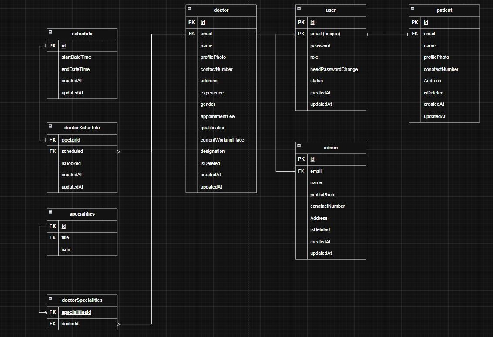
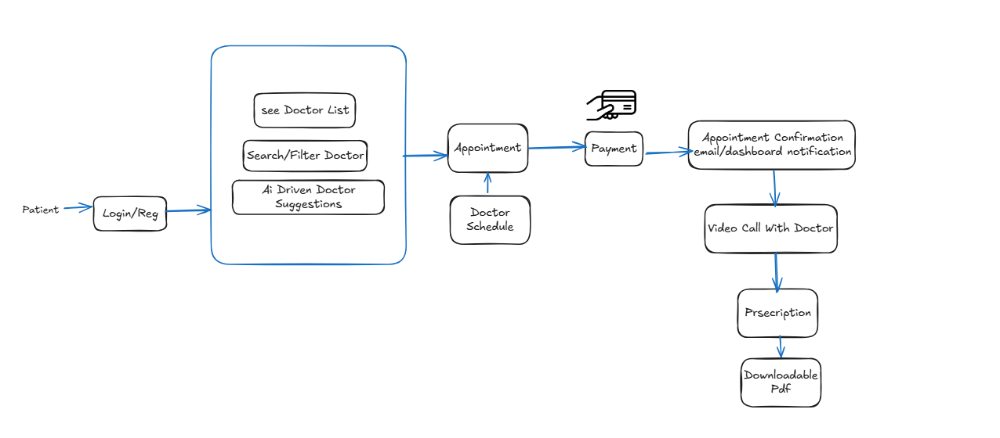
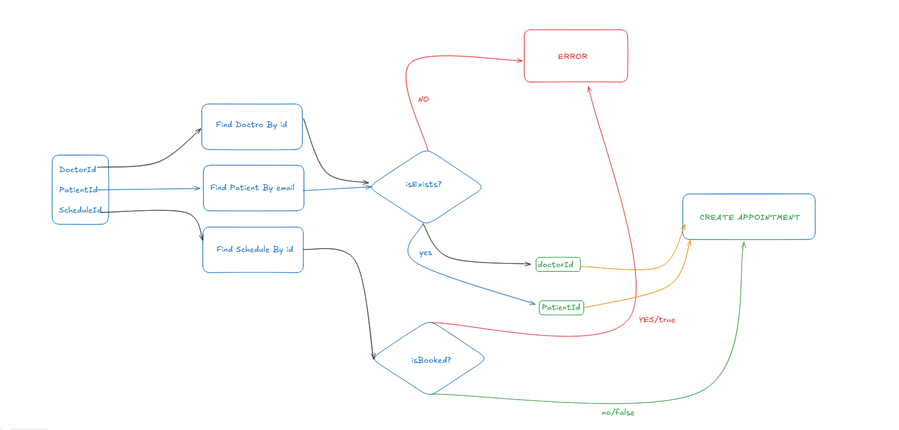
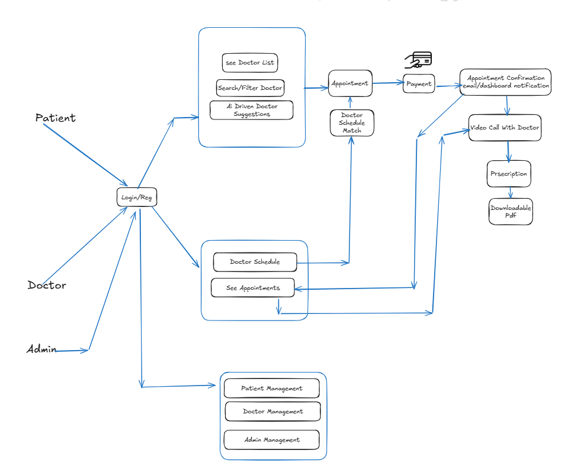

# PH-HEALTHCARE PROJECT-FOUNDATION-AND-DATABASE-SETUP

## 56-1 Introduction to the “PH Health Care” Project

## 56-2 Requirement Analysis – Part 1
- Patient Works in My Ph Healthcare Site 

## 56-3 Requirement Analysis – Part 2

- Doctor works and relations 

## 56-4 Requirement Analysis – Part 3
- Lets see admin works

- Lets Finalize Tech Stacks first 

- we will use 
    1. Node.js 
    2. Express.js 
    3. Postgresql 
    4. Prisma 
    5. sslcomerz
    6. nodemailer/resend/mailgun 
    8. Ai Agent 
    9. Rate limiter 