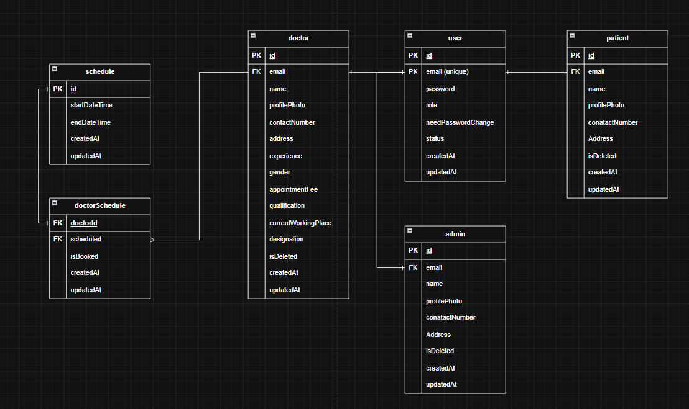

# PH-HEALTHCARE PROJECT-FOUNDATION-AND-DATABASE-SETUP

## 56-1 Introduction to the “PH Health Care” Project


## 56-2 Requirement Analysis – Part 1

- Patient Works in My Ph Healthcare Site


## 56-3 Requirement Analysis – Part 2

- Doctor works and relations


## 56-4 Requirement Analysis – Part 3

- Lets see admin works


- Lets Finalize Tech Stacks first

- we will use
  1. Node.js
  2. Express.js
  3. Postgresql
  4. Prisma
  5. sslcomerz
  6. nodemailer/resend/mailgun
  7. Ai Agent
  8. Rate limiter

## 56-5 Cloning & Running the Starter Pack

[Starter Template](https://github.com/Apollo-Level2-Web-Dev/ph-health-care-server/tree/part-1)

## 56-6 Setting up Prisma in the Starter Pack

- Install The dependency

```
npm install
```

- Install prisma

```
npm install prisma --save-dev
```

- install prisma Client

```
npm install @prisma/client
```

- now generate prisma folder

```
npx prisma init
```

- setup schema.prisma

```ts

generator client {
  provider = "prisma-client-js"
}

datasource db {
  provider = "postgresql"
  url      = env("DATABASE_URL")
}
```

- set the database url from prisma site and your pass of postgres

```prisma
generator client {
  provider = "prisma-client-js"
}

datasource db {
  provider = "postgresql"
  url      = env("DATABASE_URL")
}

model user {
  id Int @id @default(autoincrement())
  name String
}
```

- run this command for migrating the database

```
npx prisma migrate dev
```

## 56-7 Designing the ERD (User, Patient, Doctor, Admin)



## 56-8 Writing Prisma Schema for User, Doctor, and Patient

- creating schema

```prisma
generator client {
  provider = "prisma-client-js"
}

datasource db {
  provider = "postgresql"
  url      = env("DATABASE_URL")
}

model User {
  id                 String     @id @default(uuid())
  email              String     @unique
  password           String
  role               UserRole   @default(PATIENT)
  needPasswordChange Boolean    @default(true)
  status             UserStatus @default(ACTIVE)
  createdAt          DateTime   @default(now())
  updatedAt          DateTime   @updatedAt

  @@map("users") // in which name will be saved in the database
}

model Admin {
  id            String   @id @default(uuid())
  name          String
  email         String   @unique
  profilePhoto  String?
  contactNumber String
  isDeleted     Boolean  @default(false)
  createdAt     DateTime @default(now())
  updatedAt     DateTime @updatedAt

  @@map("admins")
}

model Doctor {
  id                  String   @id @default(uuid())
  name                String
  email               String   @unique
  profilePhoto        String?
  contactNumber       String
  address             String
  registrationNumber  String
  experience          Int      @default(0)
  gender              Gender
  appointmentFee      Int
  qualification       String
  currentWorkingPlace String
  designation         String
  isDeleted           Boolean  @default(false)
  createdAt           DateTime @default(now())
  updatedAt           DateTime @updatedAt

  @@map("doctors")
}

enum UserRole {
  PATIENT
  DOCTOR
  ADMIN
}

enum UserStatus {
  ACTIVE
  INACTIVE
  DELETED
}

enum Gender {
  MALE
  FEMALE
}

```

## 56-9 Extending Prisma Schema with Admin & Building Relations (User ↔ Admin/Patient/Doctor)

- relation added

```prisma
generator client {
  provider = "prisma-client-js"
}

datasource db {
  provider = "postgresql"
  url      = env("DATABASE_URL")
}

model User {
  id                 String     @id @default(uuid())
  email              String     @unique
  password           String
  role               UserRole   @default(PATIENT)
  needPasswordChange Boolean    @default(true)
  status             UserStatus @default(ACTIVE)
  createdAt          DateTime   @default(now())
  updatedAt          DateTime   @updatedAt
  admin              Admin?
  doctor             Doctor?
  patient            Patient?

  @@map("users") // in which name will be saved in the database
}

model Admin {
  id            String   @id @default(uuid())
  name          String
  email         String   @unique
  profilePhoto  String?
  contactNumber String
  isDeleted     Boolean  @default(false)
  createdAt     DateTime @default(now())
  updatedAt     DateTime @updatedAt
  user          User     @relation(fields: [email], references: [email])

  @@map("admins")
}

model Doctor {
  id                  String   @id @default(uuid())
  name                String
  email               String   @unique
  profilePhoto        String?
  contactNumber       String
  address             String
  registrationNumber  String
  experience          Int      @default(0)
  gender              Gender
  appointmentFee      Int
  qualification       String
  currentWorkingPlace String
  designation         String
  isDeleted           Boolean  @default(false)
  createdAt           DateTime @default(now())
  updatedAt           DateTime @updatedAt
  user                User     @relation(fields: [email], references: [email])

  @@map("doctors")
}

model Patient {
  id            String   @id @default(uuid())
  name          String
  email         String   @unique
  profilePhoto  String?
  contactNumber String
  address       String
  isDeleted     Boolean  @default(false)
  createdAt     DateTime @default(now())
  updatedAt     DateTime @updatedAt
  user          User     @relation(fields: [email], references: [email])

  @@map("patients")
}

enum UserRole {
  PATIENT
  DOCTOR
  ADMIN
}

enum UserStatus {
  ACTIVE
  INACTIVE
  DELETED
}

enum Gender {
  MALE
  FEMALE
}

```
- run prisma command 

```
npx prisma migrate dev
```