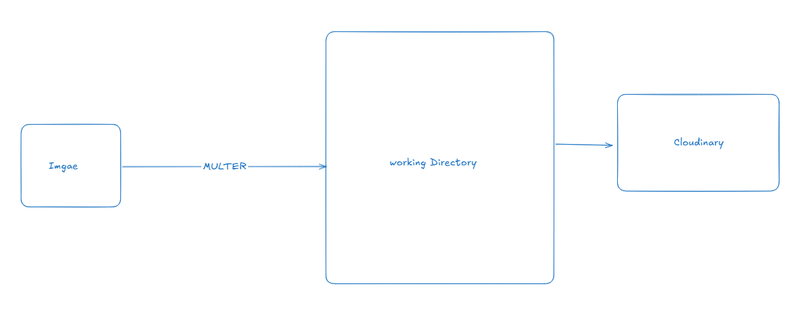

# Patient-Management-And-Authentication-Setup

## 57-1 Creating Patient (User) – Part 1
- app.ts 

```ts 
import express, { Application, NextFunction, Request, Response } from 'express';
import cors from 'cors';
import globalErrorHandler from './app/middlewares/globalErrorHandler';
import notFound from './app/middlewares/notFound';
import config from './config';

import router from './app/routes';

const app: Application = express();
app.use(cors({
    origin: 'http://localhost:3000',
    credentials: true
}));

//parser
app.use(express.json());
app.use(express.urlencoded({ extended: true }));

app.use("/api/v1", router)


app.get('/', (req: Request, res: Response) => {
    res.send({
        message: "Server is running..",
        environment: config.node_env,
        uptime: process.uptime().toFixed(2) + " sec",
        timeStamp: new Date().toISOString()
    })
});


app.use(globalErrorHandler);

app.use(notFound);

export default app;
```

- src -> app -> modules -> user.routes.ts 

```ts 
import express from 'express'
import { UserController } from './user.controller'

const router = express.Router()

router.post("/create-patient",UserController.createPatient )

export const UserRoutes = router 
```
- src -> app -> modules -> user.controller.ts 

```ts
import { Request, Response } from "express";
import catchAsync from "../../shared/catchAsync";

const createPatient = catchAsync(async (req: Request, res: Response) => {
    console.log("Patient Created! ", req.body)
})


export const UserController = {
    createPatient
}
```

## 56-10 Organizing Prisma Schema into Multiple Files

- lets organize
- Create prisma -> schema
- here each operation will be separated

- schema.prisma

```prisma
generator client {
  provider = "prisma-client-js"
}

datasource db {
  provider = "postgresql"
  url      = env("DATABASE_URL")
}

```

- enum.prisma

```prisma
enum UserRole {
  PATIENT
  DOCTOR
  ADMIN
}

enum UserStatus {
  ACTIVE
  INACTIVE
  DELETED
}

enum Gender {
  MALE
  FEMALE
}

```

- we basically do not need to export or import the types. prisma handles these if we maintain the folder structure

- user.prisma

```prisma
model User {
  id                 String     @id @default(uuid())
  email              String     @unique
  password           String
  role               UserRole   @default(PATIENT)
  needPasswordChange Boolean    @default(true)
  status             UserStatus @default(ACTIVE)
  createdAt          DateTime   @default(now())
  updatedAt          DateTime   @updatedAt
  admin              Admin?
  doctor             Doctor?
  patient            Patient?

  @@map("users") // in which name will be saved in the database
}

model Admin {
  id            String   @id @default(uuid())
  name          String
  email         String   @unique
  profilePhoto  String?
  contactNumber String
  isDeleted     Boolean  @default(false)
  createdAt     DateTime @default(now())
  updatedAt     DateTime @updatedAt
  user          User     @relation(fields: [email], references: [email])

  @@map("admins")
}

model Doctor {
  id                  String   @id @default(uuid())
  name                String
  email               String   @unique
  profilePhoto        String?
  contactNumber       String
  address             String
  registrationNumber  String
  experience          Int      @default(0)
  gender              Gender
  appointmentFee      Int
  qualification       String
  currentWorkingPlace String
  designation         String
  isDeleted           Boolean  @default(false)
  createdAt           DateTime @default(now())
  updatedAt           DateTime @updatedAt
  user                User     @relation(fields: [email], references: [email])

  @@map("doctors")
}

model Patient {
  id            String   @id @default(uuid())
  name          String
  email         String   @unique
  profilePhoto  String?
  contactNumber String
  address       String
  isDeleted     Boolean  @default(false)
  createdAt     DateTime @default(now())
  updatedAt     DateTime @updatedAt
  user          User     @relation(fields: [email], references: [email])

  @@map("patients")
}

```

- before migration we have to mention in package.json to let prisma know what is going on and where is the conflict

```json

  "prisma": {
    "schema": "./prisma/schema"
  },
```

- now migrate

```
npx prisma migrate dev
```

## 57-3 Building File Upload Helper with Multer

- For Image Uploading we will use third party package named `cloudinary` with `multer`
- Install Multer

```
npm i multer
```

- install types for multer

```
npm i --save-dev @types/multer
```

- dummy multer functionality
- app -> helper -> fileUploader.ts

```ts
import multer from "multer";

const storage = multer.diskStorage({
  destination: function (req, file, cb) {
    cb(null, "/tmp/my-uploads");
  },
  filename: function (req, file, cb) {
    const uniqueSuffix = Date.now() + "-" + Math.round(Math.random() * 1e9);
    cb(null, file.fieldname + "-" + uniqueSuffix);
  },
});

const upload = multer({ storage: storage });
```
- Now Lets Fix this and optimize for our system. 



app -> helper -> fileUploader.ts

```ts
import multer from 'multer'
import path from 'path'

const storage = multer.diskStorage({
    destination: function (req, file, cb) {
        // cb(null, '/tmp/my-uploads')
        cb(null, path.join(process.cwd(), "/uploads")) //C:\Users\Sazid\my-project\uploads

    },
    filename: function (req, file, cb) {
        const uniqueSuffix = Date.now() + '-' + Math.round(Math.random() * 1E9)
        cb(null, file.fieldname + '-' + uniqueSuffix)
    }
})

const upload = multer({ storage: storage })
```
- Now Install Cloudinary

```
npm install cloudinary
```
- app -> helper -> fileUploader.ts

```ts 
import multer from 'multer'
import path from 'path'
import { v2 as cloudinary } from 'cloudinary'

const storage = multer.diskStorage({
    destination: function (req, file, cb) {
        // cb(null, '/tmp/my-uploads')
        cb(null, path.join(process.cwd(), "/uploads")) //C:\Users\Sazid\my-project\uploads

    },
    filename: function (req, file, cb) {
        const uniqueSuffix = Date.now() + '-' + Math.round(Math.random() * 1E9)
        cb(null, file.fieldname + '-' + uniqueSuffix)
    }
})

const upload = multer({ storage: storage })

// for cloudinary 
const uploadToCloudinary =  async (file : Express.Multer.File) =>{
    
}
```